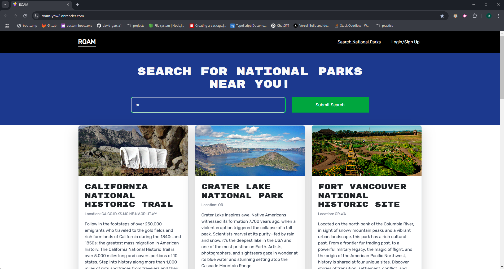
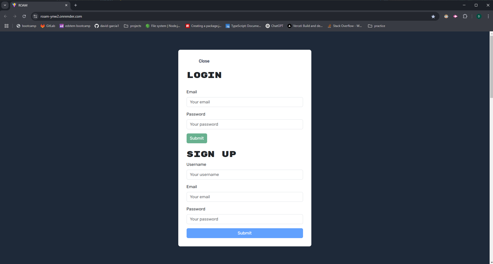

# ROAM 🌍

## Live URL
[ROAM Website](https://roam-sigma.vercel.app/)

## Description 🏕️
ROAM is the perfect platform for outdoor enthusiasts who want to explore new destinations, discover hidden gems in their own "backyard," and save dream locations for future adventures. Whether you're a hiker, camper, or road tripper, ROAM helps you plan and organize your outdoor experiences with ease.

## Tech Stack 🛠️
ROAM is built using the **MERN stack**, which includes:
- **MongoDB** 🍃 - For database management
- **Express.js** 🚀 - For backend server handling
- **React.js** ⚛️ - For dynamic and responsive frontend UI
- **Node.js** 🖥️ - For server-side JavaScript execution

## Features ✨
- 🔍 **Explore Nearby Locations** - Find new places to visit based on your current location
- ⭐ **Save Favorite Destinations** - Bookmark dream locations for future trips
- 👤 **User Profiles** - Keep track of past trips and wishlist locations
- 🗺️ **Interactive Map** - View destinations and plan routes effectively
- 🤝 **Community Sharing** - Share experiences, tips, and photos with other outdoor enthusiasts

## Contributors 👨‍💻👩‍💻
- **Michael Kelly**
- **Jacob Baqleh**
- **David Garcia**

## License 📜
This project is licensed under the **MIT License**.

## Contact 📩
For any inquiries or contributions, feel free to reach out to the contributors or submit an issue on the repository.

## Screenshots 📷

🚀 **Happy exploring with ROAM!**
